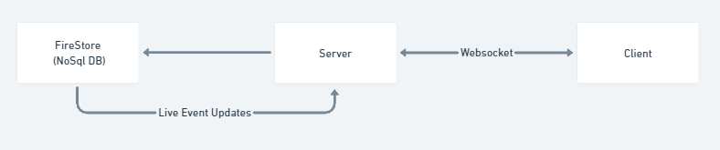

# Web dev challenge: Pixel Paint

## Running the app

Here is a set up a boilerplate React app (create-react-app) with an express server backend.
Try to run multiple instances to see different clients making changes to the server.

To run it:

- Run `npm install` to install the project dependencies in both the `client` and the `server` directories.
- Build/Compile the TS Server by running `npm run build` or `npx tsc` inside `server`.
- Launch the Server by running `npm start` inside `server`
- Launch the client by running `npm start` inside `client`.
- Access the app at [http://localhost:3000](http://localhost:3000).

To Improve:

- Move Shared Server and Client types to either have a single source for global types (either using build d.ts files or uploading an npm dependecy for types)

- Create an anonymous user flow for visitors that dont want to have a name.

- Store multiple canvas's in the Server
- Add ability to browse/load the server's stored Canvas

- Store the Server canvas to a DB (NoSql DB that can listen to live event updates)

